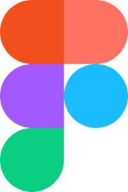
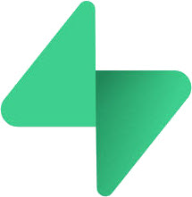
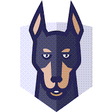
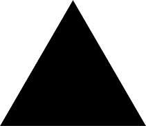

 

# Company Story:

PQX Global has more than three decades experience in automation, instrumentation and electrical installations. PQX Global loves the challenge of developing innovative solutions to complex problems. We are passionate about pushing boundaries and delivering results that exceed expectations. Making the world go round, one project at a time. PQX Global is at the forefront of developing efficient applications for energy, mobility, and industry.

## Some examples of past projects:
 
-	Software Development of an application for cable pulling at a <a href="https://www.youtube.com/watch?v=0khaNwUIq2U&t=7s" title="Drilling Rig">Drilling rig</a>.
-	Software Development of an application for commissioning of a <a href="https://en.wikipedia.org/wiki/Infraspeed" title="HSL">High speed railway</a>.
- Software Development of a webshop for safety gear with <a href="https://www.lightspeedhq.com/" title="Lightspeed">Lightspeed</a>.
-	Engineering of hardware for the AGM <a href="https://www.youtube.com/watch?v=wu27rzasVNM" title="AGM">Advanced generator monitor</a>.
- Engineering for electrical system study at a <a href="https://www.youtube.com/watch?v=NgORKTMjjvM" title="Food Processing">Food Processing Plant</a>.
-	Construction of a <a href="chemical-plant.md" title="Chemical Plant">Chemical Plant</a>.
-	Construction of a <a href="https://www.youtube.com/watch?v=eY9Lo7Aqo4g" title="Laboratory">Laboratory</a>.
-	Construction of a <a href="https://www.youtube.com/watch?v=r-J392UzpyI" title="Catalytic Reactor">Catalytic Reactor</a>.
-	Construction of a <a href="refinery.md" title="Refinery">Refinery</a>.
-	Construction of a <a href="https://www.youtube.com/watch?v=wmFy6a8g6-Y" title="LNG Plant">LNG Plant</a>.
-	Construction of 5 <a href="power-plant.md" title="Power Plants">Power Plants</a>.
 -	Construction of a <a href="https://www.youtube.com/watch?v=mtUVJRciSbA" title="Waste Incinerator">Waste Incinerator</a>.
-	Commissioning of 2 <a href="https://www.youtube.com/watch?v=IVUcauJSbQY" title="Drilling Rigs">Drilling Rigs</a>.
- Commissioning of a <a href="https://www.youtube.com/watch?v=mLjOg9j3WgU" title="Natural Gas Plant">Natural Gas Plant</a>.

  
  
# PQX Global is ready to bring Power, Quality and Expertise to your Next project by using the following tech stack:
 
&nbsp;

## Project Management:

## Architecture:

## Design:

 

## Development:

## Databases:

## Security:

## Testing:

## Payments:

## Mailing:

## Hosting & CDN & CI/CD:

# Contact:
info@pqxglobal.com
 

