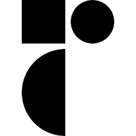
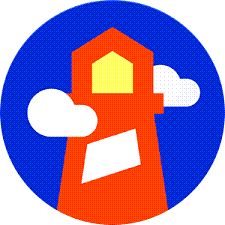

 

# About Us:

<h3>2008 – 2015: Instrucontrols Era</h3>
JustProgressIT's journey began in 2008 as Instrucontrols, specializing in project support, commissioning management, and supervision within the electrotechnical and instrumentation discipline. During this phase, the company successfully supported multiple construction projects for prominent engineering and operating companies like Shell, BP, Fluor, and CB&I Lummus.
<h3>2015 – 2019: Easypower Europ Ventures</h3>
In 2015, Instrucontrols transformed into Easypower Europ, focusing on sales, project support, and software development support for EasyPower® electrotechnical engineering software. The company played a pivotal role in modifying the EasyPower® software for the European market. Subsequently, the EasyPower® software achieved successful sales, being acquired by Bentley Systems®. During this period, Easypower Europ also embarked on the development of the AGM Advanced Generator Monitoring system. Although the apparatus was successfully completed and commissioned, it didn't make it to sales. Nevertheless, the AGM continues to be utilized for testing generators.
<h3>2019 – 2023: PQX Global and Adaptation</h3>
Pivoting in 2019, the company transformed into PQX Global, aiming to establish an e-commerce platform for the sales of electrical personal protective equipment (PPE). Unfortunately, intense competition led to the difficult decision to halt this venture. During the challenging period of the COVID-19 pandemic, the company adapted by embracing a full-time study on web development.
<h3>2023 – Present: JustProgressIT Emerges</h3>
In 2023, JustProgressIT emerged from the shadows, focusing on the development of websites, web applications, and e-commerce sites. The company's ethos revolves around embracing challenges and providing innovative solutions to complex problems. JustProgressIT has a passion for pushing boundaries, consistently delivering results that surpass expectations. Positioned at the forefront of technological advancements, the company is dedicated to developing efficient applications for sectors such as energy, mobility, and industry but other sectors are also welcome. Making the world go round, one project at a time, JustProgressIT is committed to progress and excellence in the ever-evolving landscape of web development, web applications and e-commerce solutions.

## Some examples of past projects:
 
-	Software Development of an application for cable pulling at a <a href="https://www.youtube.com/watch?v=0khaNwUIq2U&t=7s" title="Drilling Rig">Drilling rig</a>.
-	Software Development of an application for commissioning of a <a href="https://en.wikipedia.org/wiki/Infraspeed" title="HSL">High speed railway</a>.
- Software Development of a webshop for safety gear with <a href="https://www.lightspeedhq.com/" title="Lightspeed">Lightspeed</a>.
-	Engineering of hardware for the AGM <a href="https://www.youtube.com/watch?v=wu27rzasVNM" title="AGM">Advanced generator monitor</a>.
- Engineering for electrical system study at a <a href="https://www.youtube.com/watch?v=NgORKTMjjvM" title="Food Processing">Food Processing Plant</a>.
-	Construction of a <a href="chemical-plant.md" title="Chemical Plant">Chemical Plant</a>.
-	Construction of a <a href="https://www.youtube.com/watch?v=eY9Lo7Aqo4g" title="Laboratory">Laboratory</a>.
-	Construction of a <a href="https://www.youtube.com/watch?v=r-J392UzpyI" title="Catalytic Reactor">Catalytic Reactor</a>.
-	Construction of a <a href="refinery.md" title="Refinery">Refinery</a>.
-	Construction of a <a href="https://www.youtube.com/watch?v=wmFy6a8g6-Y" title="LNG Plant">LNG Plant</a>.
-	Construction of 5 <a href="power-plant.md" title="Power Plants">Power Plants</a>.
 -	Construction of a <a href="https://www.youtube.com/watch?v=mtUVJRciSbA" title="Waste Incinerator">Waste Incinerator</a>.
-	Commissioning of 2 <a href="https://www.youtube.com/watch?v=IVUcauJSbQY" title="Drilling Rigs">Drilling Rigs</a>.
- Commissioning of a <a href="https://www.youtube.com/watch?v=mLjOg9j3WgU" title="Natural Gas Plant">Natural Gas Plant</a>.

  
  
# Just Progress IT is ready to bring Progression, Quality and Expertise to your Next project by using the following tech stack:
 
&nbsp;

## Project Management:

## Architecture:

## Design:

 

## Development:

## Databases:

## Security:

## Testing:

## Payments:

## Mailing:

## Hosting & CDN & CI/CD:

# Contact:
info@justprogressit.tech
 

